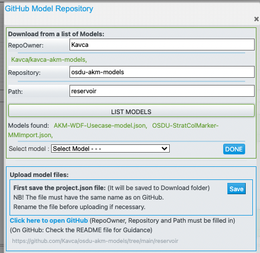

| Readme | [Project](https://github.com/orgs/Kavca/projects/3) | [Upload models](UploadModels.md) | [About](about.md) | 

#  OSDU Models

Click on the links below to open the models in AKM Modeller:

## Production 

- [EQUINOR Wellbore Concept Model](https://akmmclient-main.vercel.app/modelling?org=kavca&repo=osdu-akm-models&path=production&file=EQUINOR%20Wellbore%20Concept%20Model.json&branch=main)

- [EQUINOR Wellbore Solution Model](https://akmmclient-main.vercel.app/project?org=kavca&repo=osdu-akm-models&file=EQUINOR%20Wellbore%20Solution%20Model.json&branch=main)

- [EQUINOR Wellbore Model](https://akmmclient-main.vercel.app/project?org=kavca&repo=osdu-akm-models&path=production&file=EQUINOR%20Wellbore%20Model.json&branch=main)

---

- [AKM-Production-Measurements-Conceptmodel](https://akmmclient-main.vercel.app/project?org=kavca&repo=osdu-akm-models&path=production&file=AKM-Production-Measurements-Conceptmodel_PR.json&branch=main)
- 
- [OSDU-Welltest-Example](https://akmmclient-main.vercel.app/project?org=kavca&repo=osdu-akm-models&path=production&file=OSDU-Welltest-Example_PR.json&branch=main)
;

---

This is a public repo for OSDU AKM models made in AKM Modeller and saved as .json files.

## Introduction

AKM Modelling files can be stored locally on your computer as Project.json files.  
AKM Modelling files can also be done as a collaborate task with several team members with Project.json files stored in a GitHub repository.

---

    Note:
    Click on "Project" in the top menu to open the Projects Canban to follow the progress of the project. 
    You can contribute by clicking "Add item" in the Input column of the Canban. 
    You can also add comments to the existing Cards.

## Lets get started

<code>Tips: This page can also be viewed on: [View the project on GitHub](https://github.com/Kavca/osdu-akm-models)) (Right-Click to open in separate window!</code>

Open the webpage:  

<https://akmclient-beta.herokuapp.com/modelling> latest version with newest features

<https://akmclient.herokuapp.com/modelling> previous more tested version

---

### To start a new model project

Click on the GitHub button in the top menu to open the GitHub download dialog.

Fill in the dialog:

RepoOwner: "Kavca"
Repository: "kavca-akm-models"
Path: "startmodels"

Clik the "LIST MODELS" button to list the models in the repository.
Select one of the start models and click "DONE"

To rename the project, model and modelview, select the "_ADMIN_MODEL in the model dropdown menu.

- Change the name of the project object to your project name.
- Change the name of the Model object to your model name.
- Change the name of the Modelview object to your modelview name, i.e. "01-Main".

Right click the background and select "Update Project from AdminModel.

Click refresh (Blue text in the top right corner)

Now you can start modeling.

---  

***(In AKM Modeller)***

Select "Modelling" in the top menu.

## Open and save local files

### 1. Open a Project.json file in AKM Modeller

Open local project files: <code> Click: "Choose file" button</code>

Click on: Project files: "Choose file" button and select the project file you want to load (.json file).

The selected file will be loaded in the AKM Modeller.

---

### 2. Then Work with your model project

See the documentation how to used AKM Modeller in "Help" in top menu.

---

### 3. Save your model project to Local Project.json file

---

To save local project files: <code> Click on: "Save" button</code>

To save the current project.json file Click on the "Save" button.

The file will by default be saved in Download folder as a "Projectname".json file.

---

### You can set up your browser to enable save to a folder

 
 <code>Browser setup:</code> 

This makes it possible to overwrite the file you have loaded (you don't have to rename the model-file every time).

<code>For Chrome:</code>

Click on the three dots in upper right corner of the browser" and select "Settings" and then "Downloads" and enable the "Ask where to save each file before downloading".

<code>For Edge:</code>

Click on the three dots in upper right corner of the browser" and select "Settings" and then "Downloads" and enable the "Ask me what to do with each download".
<code>For Safari:</code>

Safari does not have the option select folder, but will download to the "Download" folder.
Downloaded files will be deleted after one day by default.

---
---

## Open and save models on GitHub repository

To open a model stored on GitHub repository:

Open GitHub repository AKM project files in AKM Modeller: <code> Click on: "GitHub" button</code>

..

Click on "GitHub" button to open the dialog for GitHub repository and fill in the required fields.

- Repository URL:  <https://api.github.com/users/UserName/repos/>

then click on: "LIST MODELS" button and then select a model in the "Select Model" dropdown list.

(The list is from the **main** branch of the repository.)

The model will be loaded in AKM Modeller.

Click on "X" button in the top right corner to close the GitHub repository select dialog.

---

---

To upload a model to GitHub repository:

First make sure you have saved your Project.json file locally (the model you want to upload), as described in item 3 above.

[Procedure for uploading to Github repository](UploadModels.md)

